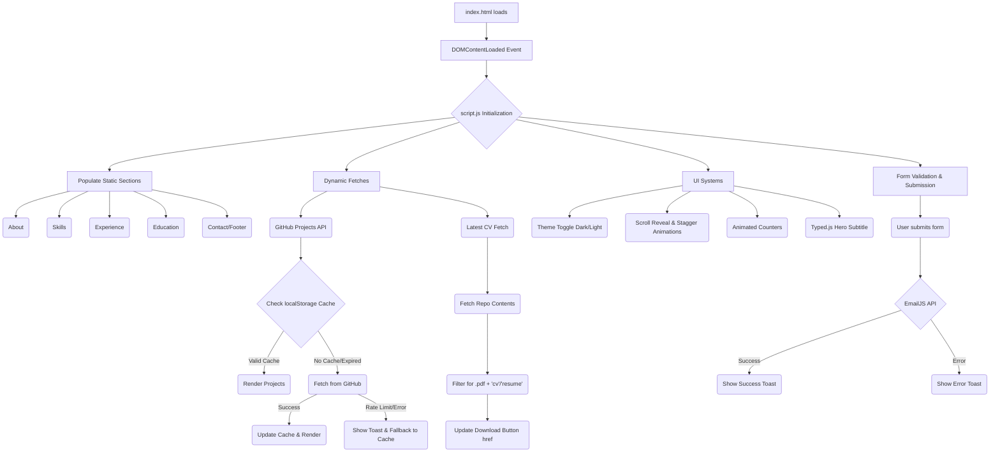

# Portfolio Codebase Map & Logic Schema

**Live URL:** [https://tafabande.github.io/portfolio/](https://tafabande.github.io/portfolio/)

## Directory Structure
```
/portfolio
│
├── index.html       # Main HTML structure, semantics, and SEO tags
├── styles.css       # Custom properties, layout, animations, theme override
├── script.js        # Core logic, dynamic population, API fetches, form handling
├── robots.txt       # Search engine crawler instructions
├── sitemap.xml      # Sitemap for SEO indexing
├── vercel.json      # Vercel deployment config
└── README.md        # Basic repository information
```

## Logic & Flow Architecture

The portfolio operates as a static Single Page Application (SPA). All content is dynamically driven by a centralized JavaScript object (`portfolioData`), making it extremely easy to update and maintain without altering HTML structure.



## Key Components

### 1. Data Schema (`portfolioData` in `script.js`)
Instead of hardcoding text into the HTML, data is managed in the `portfolioData` object at the top of `script.js`.
- **`profile`**: Basic info, titles, description.
- **`skills`**: Categorized arrays of technical skills and tools.
- **`experience` & `education`**: Arrays of timeline items.
- **`contact` & `emailjs`**: Social links and EmailJS API keys.

### 2. Styling System (`styles.css`)
- **CSS Variables (`:root`)**: The foundation of the design. Colors, typography, spacing, and transitions are defined here.
- **Tegaki Font**: `Yomogi` (Google Font) is used for headings and accents to give it a human, natural feel, paired with `Inter` for highly readable body text.
- **Fluidity**: Elements use `cubic-bezier` transitions for smooth hover states and staggered entry animations.
- **Themes**: Uses `[data-theme="light"]` attribute on the `<html>` tag to override variables for Light Mode.

### 3. API Integrations
- **GitHub API (`fetchGitHubProjects`)**: 
  - Automatically fetches public repositories for `tafabande`.
  - Filters out forks and empty repos.
  - Implements a 1-hour `localStorage` caching mechanism to avoid rate limits and improve speed.
- **GitHub API (`fetchLatestCV`)**:
  - Dynamically scans the repository contents for the newest PDF containing "CV" or "Resume" in the filename.
  - Automatically binds this file to the Download CV button in the hero section.
- **EmailJS**: Handles the contact form submission directly from the client side without needing a backend server.

### 4. Toast Alert System
A lightweight, custom notification system.
- Invoked via `showToast(message, type)`.
- Types: `'success'`, `'error'`, `'info'`.
- Auto-dismisses after 4 seconds with smooth CSS animations.
